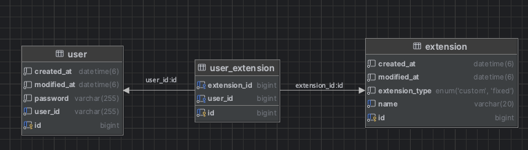

# 파일 확장자 과제 제출

## 📃 API 명세서
보다 자세한 사항과 테스트는 Swagger 를 통해서 확인하실 수 있습니다.

# 📘 API 명세서

---
## ✨ 유저 (User)

| HTTP Method | Endpoint               | 설명                    |
|-------------|------------------------|-------------------------|
| `POST`      | `/api/users/signup`    | 회원가입                |
| `POST`      | `/api/users/login`     | 로그인 (JWT 반환)       |
| `POST`      | `/api/users/login/v2`  | 로그인 (JWT 쿠키 저장)  |

---

## ⛔ 확장자 차단 (Blocking)

### 🔒 고정 확장자

| HTTP Method | Endpoint                                                 | 설명              |
|-------------|----------------------------------------------------------|-------------------|
| `GET`       | `/api/blocking/extensions/fixed`                         | 고정 확장자 조회  |
| `PATCH`     | `/api/blocking/extensions/fixed/{extensionId}/toggle`   | 고정 확장자 토글  |

---

### 🧷 커스텀 확장자

| HTTP Method | Endpoint                                                | 설명               |
|-------------|---------------------------------------------------------|--------------------|
| `POST`      | `/api/blocking/extensions/custom`                       | 커스텀 확장자 생성 |
| `GET`       | `/api/blocking/extensions/custom`                       | 커스텀 확장자 조회 |
| `DELETE`    | `/api/blocking/extensions/custom/{extensionId}`         | 커스텀 확장자 삭제 |
---

## 🌳 코드 구조

```
├── BlockingServiceApplication.java
├── component
│   └── ExtensionCleaner.java
├── config
│   ├── CorsConfig.java
│   ├── SecurityConfig.java
│   └── SwaggerConfig.java
├── controller
│   ├── BlockingController.java
│   └── UserController.java
├── domain
│   ├── dto
│   │   ├── CustomUserDetails.java
│   │   ├── ExtensionDto.java
│   │   └── UserDto.java
│   ├── entity
│   │   ├── AuditingFields.java
│   │   ├── Extension.java
│   │   ├── ExtensionType.java
│   │   ├── User.java
│   │   └── UserExtension.java
│   ├── request
│   │   ├── CreateCustomExtensionRequest.java
│   │   ├── LoginRequest.java
│   │   └── SignUpRequest.java
│   └── response
│       ├── ApiSuccessResponse.java
│       └── ErrorResponse.java
├── exception
│   ├── BaseException.java
│   └── ErrorCode.java
├── handler
│   └── GlobalExceptionHandler.java
├── jwt
│   ├── JwtAuthenticationFilter.java
│   └── JwtUtil.java
├── repository
│   ├── ExtensionRepository.java
│   ├── UserExtensionRepository.java
│   └── UserRepository.java
└── service
    ├── BlockingService.java
    ├── CustomUserDetailsService.java
    ├── ExtensionService.java
    ├── UserExtensionService.java
    └── UserService.java
```
# Teck Stack
### Tech Stack
- Open JDK 17, Spring Boot 3.3.8, Spring JPA, MySql8, Spring security, JWT
- Next.js, Docker, AWS

## ✨ 주요 기능 및 설계
### 1. 도메인 선정 및 설계 배경

이 프로젝트는 특정 확장자 파일들에 대한 차단/허용 정책을 사용자 단위로 관리하는 서비스입니다. 이를 위해 **확장자 정보(Extension)** 와 **사용자별 확장자 설정(UserExtension)** 을 분리하여 관리하며, `고정 확장자` 와 `커스텀 확장자` 두 가지 유형을 제공합니다.

---

### ✅ 설계 배경

- 확장자에 대한 메타 정보(이름, 유형 등)는 **정적 자원**으로 보아 `Extension` 엔티티로 분리
- 사용자마다 허용/차단할 확장자 설정은 다르기 때문에 **UserExtension** 테이블로 N:M 관계 분리
- 고정 확장자(FIXED)는 기본 제공되며, 사용자가 개별적으로 활성화 여부를 토글할 수 있음
- 커스텀 확장자(CUSTOM)는 사용자가 직접 추가 및 삭제 가능
- 확장자 로직과 유효성 검사를 도메인 내부에서 수행하여 **비즈니스 규칙 누락을 방지**

이러한 설계를 통해, 사용자 단위로 파일 확장자 정책을 유연하게 적용하면서도, 고정 확장자의 통제와 커스텀 확장자의 자유로운 추가/삭제를 모두 만족할 수 있도록 구성했습니다.

### 📁 핵심 도메인 설계



#### 🧩 Extension (확장자 정보)

- **id**: 확장자 고유 ID (PK)
- **name**: 확장자 명 (예: exe, bat, js 등)
- **extensionType**: 확장자 유형 (FIXED: 고정, CUSTOM: 커스텀)
- **createdAt / modifiedAt**: 생성 및 수정 시간 (Auditing)

> 확장자명은 중복 저장되지 않도록 `unique 제약조건`을 부여하였으며,
> 유효성 검사(validate)를 통해 길이 제한(20자), 공백 여부, 타입 존재 여부를 검사합니다.

---

#### 🔗 UserExtension (사용자-확장자 관계)

- **id**: 사용자 확장자 고유 ID (PK)
- **user**: 확장자를 설정한 사용자 (ManyToOne)
- **extension**: 사용자가 설정한 확장자 (ManyToOne)

> 사용자의 고정/커스텀 확장자 설정을 관리하는 **연결 테이블**로써, `user_id + extension_id`를 유니크 키로 설정하여 중복 설정을 방지합니다.

---

### 2. JWT 인증 기반 보안 흐름 구성 + 쿠키 적용
- 로그인 시 JWT 발급 및 access_token을 HttpOnly 쿠키로 세팅
- 인증이 필요한 요청에서는 @AuthenticationPrincipal 기반으로 인증 사용자 객체 주입

### 3. N + 1 문제 해결
`UserExtension` → `ExtensionDto`로 변환하는 과정에서, 연관된 `Extension` 정보를 지연 로딩(LAZY)으로 설정한 경우 N+1 쿼리가 발생할 수 있습니다.

이를 해결하기 위해 `@EntityGraph(attributePaths = {"extension"})`를 Repository 메서드에 적용하여, `UserExtension`을 조회할 때 확장자 정보까지 한 번에 가져올 수 있도록 구성했습니다.

```java
@EntityGraph(attributePaths = {"extension"})
List<UserExtension> findByUserIdAndExtension_ExtensionType(Long userId, ExtensionType extensionType);
```

### 4. 단일 책임 원칙(SRP)을 고려한 코드 설계
> 서비스 로직을 구현함에 있어 각 클래스와 메서드는 하나의 책임만 가지도록 설계하였습니다.

- **Service Layer**: 비즈니스 로직만을 담당하며, 도메인 간의 흐름을 제어합니다.
    - 예) `BlockingService`는 확장자 차단 관련 로직만 포함하고, 인증/인가는 책임지지 않음.
- **Controller Layer**: HTTP 요청을 받아 필요한 Service를 호출하고, 응답 포맷으로 변환해 반환하는 역할에 집중합니다.
- **DTO 및 Entity 분리**: Entity는 순수한 데이터 구조 및 ORM 역할만 수행하며, 클라이언트와 주고받는 데이터는 모두 DTO로 분리하여 관리했습니다.
- **예외 처리**: `GlobalExceptionHandler`를 통해 예외 상황을 일관되게 처리하였으며, 각 도메인에서 책임 있는 검증 로직을 통해 유효성 체크를 분산했습니다.

이러한 SRP 기반 구조는 유지보수 시 각 계층이 독립적으로 변경 가능하게 하여 **확장성과 테스트 용이성**을 높였습니다.